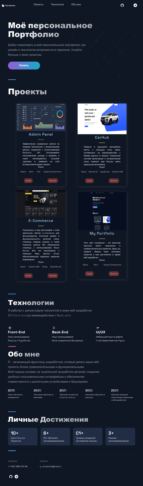

# Portfolio

## Структура проекта:
- **public/**: Статические файлы, такие как изображения и HTML файлы.
- **src/**: Исходный код проекта, включая компоненты, страницы и стили.
- **/components/**: Содержит компоненты приложения.

## Основные файлы:
- **Acomplishments**: Компонент для отображения достижений, включает список ключевых достижений и наград.
- **Header**: Компонент для отображения заголовка сайта, включает навигацию и элементы интерфейса.
- **Hero**: Компонент для отображения главного баннера на главной странице, включает приветственное сообщение и краткую информацию обо мне.
- **NavDropDown**: Компонент выпадающего меню навигации, отвечает за ссылки на различные разделы сайта.
- **Projects**: Компонент для отображения списка проектов, включает описание каждого проекта с ссылками и изображениями.
- **Technologies**: Компонент для отображения списка технологий, которыми я владею.
- **TimeLine**: Компонент для отображения временной шкалы, включает важные события и этапы моего профессионального развития.

## Основные компоненты и функции:
- **React**: Используется для создания компонентов и управления состоянием приложения.
- **Styled Components**: Используется для стилизации компонентов.
- **TypeScript**: Обеспечивает строгую типизацию и повышение надежности кода.
- **Next.js**: Фреймворк для React с поддержкой серверного рендеринга и маршрутизации.

## Основные части и функции:
- **Навигация**: Компоненты для верхней и боковой навигации по сайту.
- **Главная страница**: Включает приветственный баннер и краткую информацию обо мне.
- **Проекты**: Компоненты для отображения и описания проектов.
- **Технологии**: Компоненты для отображения списка используемых технологий.
- **Достижения**: Компоненты для отображения ключевых достижений.
- **Временная шкала**: Компоненты для отображения этапов профессионального развития.
